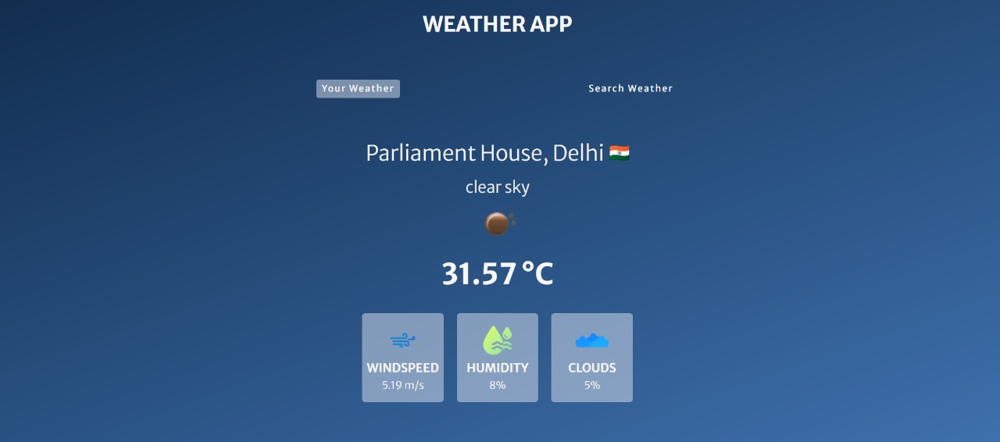
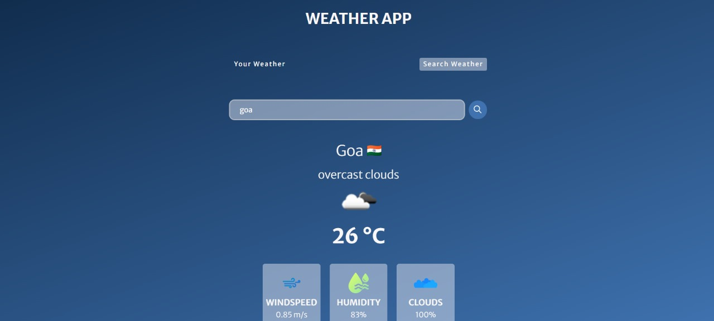

# 🚀 Weather_WebApp  

## 📌 Overview  
This project is a web-based application built using **HTML, CSS, and JavaScript**. It features a clean and responsive UI, ensuring a smooth user experience across different devices.  

## 📸 Sample UI  
Here are some screenshots showcasing the interface:  

  
  
![UI Screenshot 3](assets/ss3.jpg 

## 🔥 Features  
- **Responsive Design** – Works on all screen sizes.  
- **Interactive UI** – Smooth animations and dynamic elements.  
- **User-Friendly Navigation** – Simple and intuitive layout.  
- **Fast Performance** – Optimized for quick loading.  
- **Cross-Browser Compatibility** – Works on Chrome, Firefox, Edge, and Safari.  

## 🛠️ Tech Stack  
- **HTML** – Structuring the webpage.  
- **CSS** – Styling for a visually appealing interface.  
- **JavaScript** – Adding interactivity and dynamic content.  

## 📥 Installation & Usage  
1. Clone this repository:  
   ```bash
   git clone https://github.com/yourusername/project-name.git
   cd project-name
   ```  
2. Open `index.html` in your browser.  
3. Enjoy exploring the application!  
